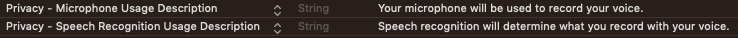

----

# speechToText
A template Swift project that uses a button to show speech to text transcription from a microphone and fills a text view as it proceeds. 

This can be used as the basis for Bose AR hardware that contains a microphone. The project uses a button, but a double-tap or another gesture could kick off microphone recording. Just a little helper project. 

### Note
You need to have privacy settings set in info.plist
* Privacy - Microphone Usage Description
* Privacy - Speech Recognition Usage Description



I built in some fuzzy string matching (which uses a 0 - 1 scoring system). Based on YICHI ZHANG's code. I have also built-in a two second end of speech detection timer, otherwise `isFinal` is passed through, but I am uncertain when that happens within Apple's own engine.

----

```swift
class ViewController: UIViewController, SpeechToTextEngineDelegate 
{
    var sttEngine:SpeechToTextEngine!
    
    override func viewDidLoad() {
        super.viewDidLoad()
        sttEngine = SpeechToTextEngine()
        sttEngine.delegate = self
    }
    
    // How to kick things off.
    @IBAction func micButtonTapped(_ sender: Any) {
        sttEngine.requestRecording()
    }
    
    // This is where the stt results come in.
    func providedResult(value s: String) {
        print(s)
    }
    
    func isListening(value: Bool) {
        if !value {
            microphoneButton.setTitle("Start Recording", for: .normal)
        } else {
            microphoneButton.setTitle("Stop Recording", for: .normal)
        }
    }
    
    func isAllowedToRecord(value: Bool) {
        // This must happen on the main UI thread. Call is made on background thread.
        OperationQueue.main.addOperation {
            self.microphoneButton.isEnabled = value
        }
    }
}
